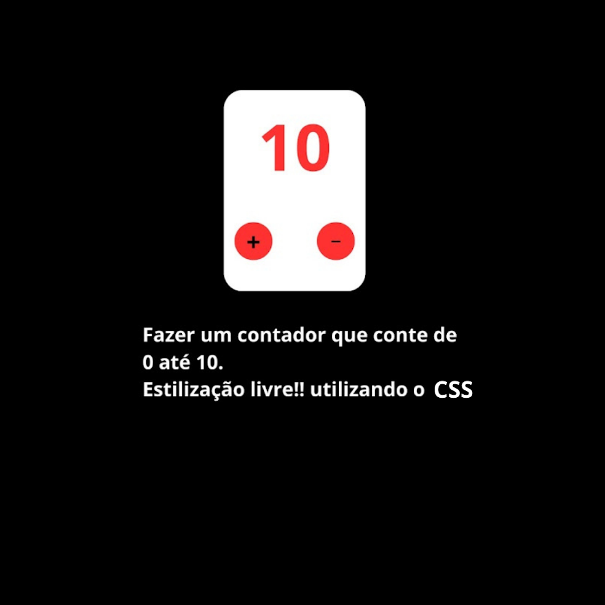

# Desafio 02 - Contador

Desenvolva um contador que tenha as seguintes funcionalidades: 
1 - O contador não pode chegar abaixo de 0  
2 - O contador não pode chegar acima de 10 

OBSERVAÇÕES: 
 
- O contador abaixo segue apenas como um exemplo. 
 
- A página pode ser feita editor de texto online Codesandbox ou pelo Visual Studio Code. 
 
- A entrega deve ser feita pelo classroom. 
 

